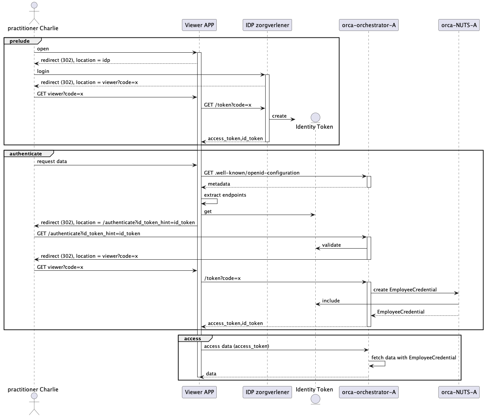

# User authentication for users from the Viewer application om ORCA

## General assumptions.
- The Viewer application runs within the same domain as the ORCA and NUTS node. The users in the viewer application log  on and authenticate themselves with the domain IdP. 
- There is a general trust relationship between the Viewer application, ORCA and the local NUTS node.
- There is a future need for further authentication; in the future ORCA might require the end-user to present a credential from the personal wallet. 

The general assumption is that:
- Additional authenticate is not required _for now_
- We do want to be able to require user interaction _in the future_

## Implementation
The ORCA application requires the Viewer application to run a OIDC flow with the id_token_hint option. This allows the ORCA application to decide whether it wants to make use of the existing authentication or requires (additional) authentication.

The main flow works as follows:
- The user logs in with OIDC on a IdP and an id_token is acquired.
- The Viewer application gets the .well-known/openid-configuration metadata.
- The OIDC flow with ORCA is initiated with the /authenticate flow with id_token_hint value set to the previously acquired id_token.
- The ORCA application validates the id_token and continues the flow without a login prompt.
- The ORCA application creates a EmployeeCredential based on the id_token in the NUTS node.
- The ORCA application provides an access_token that allows for resource access.

